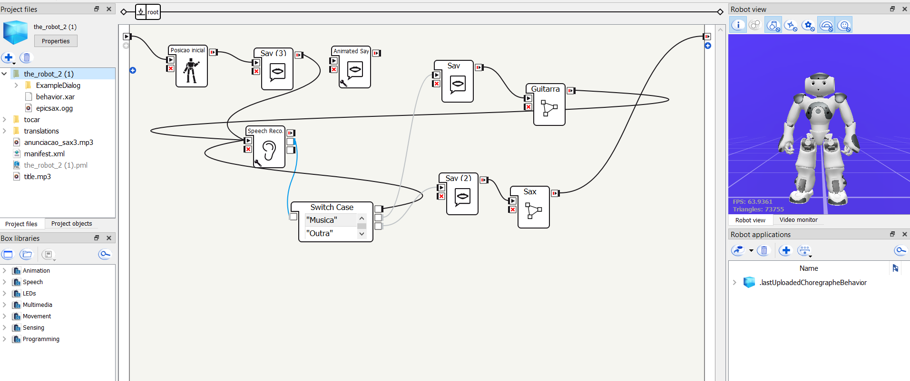

# Fundamentos_Robótica_Grupo_NAO_Coreograph

Repositório destinado ao trabalho da matéria de robótica da Fga. 

## Descrição do Projeto (NAO - Coreograph)  

### Regras gerais:  
**1.** Serão 5 entregas semanais nas quinta-feira 23h59, a partir da semana 8 (16/05/23). Atraso acarretará em desconto de 10% por dia de atraso.  
**2.** Cada entrega será feita no GitHub e deve conter  
  **2.1.** Código tipo "demo" - só baixar e rodar  
  **2.2.** vídeo do robô executando a demo - subir no youtube e colocar o link 
  **2.3.** documentação: descrição da demo na própria página do GitHub (markdown)  
**3.** Apresentação oral no retorno do professor 

### Projeto:
**1.** Criar uma apresentação para cada entrega;  
**2.** Ao menos duas com interações com usuários via sensores do robô;

- [PROJETO 01](#11)
- [PROJETO 02](#12)
- [PROJETO 03](#13)
- [PROJETO 04](#14)
- [PROJETO 05](#15)

### Integrantes:
Carlos Eduardo Leite de Oliveira - 170007707 

Breno Linhares de Sousa - 170007057

Haniel Rodrigues Guimaraes de Lima – 150036558

Vitor Rangel de Aquino Silva – 170064107

Felipe Costa Gomes - 190012757

# PROJETO 01 - Definindo Ações por Reconhecimento de Fala 

# Resumo

Para o primeiro projeto o grupo escolheu realizar as tarefas no Robô NAO e a programação foi realizada no softwre Coreography 2.8.6.23  disponível em: https://www.aldebaran.com/en/support/nao-6/downloads-softwares.

A primeira tarefa desenvolvida pelo grupo foi fazer o NAO ouvir e reconhecer palavras em português e realizar diferentes ações de acordo com a palavra pronuciada como *Sentar*, *Levantar*, *Falar* e *Pegar*. Especificamente na ação *Pegar* o NAO procura uma bola vermelha e anda até a bola e na ação *Falar* o NAO emita o latido de um cachorro.

## Conteúdo

- [Introdução](#1)
- [Video](#2)
- [Implementação](#3)
- [Código](#4)

## Instrodução

Para a implementação dessa atividade no NAO foram utilizados os microfones, alto falantes e câmera do NAO para o reconhecimento da fala, para reprodução da fala e para o processamento de imagem para detecção da bola vermelha, além de outros sensores e atuadores como motores de passo e giroscópios para o movimento das juntas do robô. A imagem abaixo detalha melhor a localização dos microfones e a câmera presente nos olhos. 

## Vídeo

O vídeo mostrando os testes do programa implementado pelo Grupo pode ser acessado pelo seguinte link: https://www.youtube.com/watch?v=vUP44cZrWn8&ab_channel=BrenoLinhares

## Implementação

A figura abaixo mostra o diagrama de blocos montado no software coreography. O diagrama realiza as seguintes tarefas:

1. Reconhecer a palavra pronuciada - implementada pelo bloco *"SPEECH RECO"* ;
2. Utilizar um *swich case* para selecionar entre as palavras *"Senta"*, "*Levanta"*, *"Late"* e *"Pega"*;
3. Dependendo da palavra reconhecida o NAO realiza a respectiva ação;
4. Primeira ação *Sentar* - implementada pelo bloco "SIT DOW";
5. Segunda ação *Levantar* - Implementada pelo bloco "STAND UP";
6. Terceira ação *Latir* - Implementada pelo bloco "SAY" configurado para reproduzir o texto "AU AU AU AU";
7. Quarta ação reconhecer e caminhar até a bola - Implementada pelos blocos "RED BALL TRACKER" e "MOVE TO"
8. Por último ao Detectar e chegar próximo a bola é carregado o bloco do código em PYTHON com os parâmetros de movimento para a realização do chute da bola

Todas as saídas dos blocos de ação são realimentados ao bloco *"SPEECH RECO"* para que o NAO possa reconhecer novas palavras após terminar de realizar a ação atual. 

OBS: No bloco *"SPEECH RECO"* foi configurado um threshold de 40 como sensibilidade para reconhecimento dos padrões da fala.

## Código
O Código implementado pode ser acessado na pasta [Projeto_1](https://github.com/themestrre/Grupo-NAO-Coreograph-/tree/main/PROJETO_1) deste repositório. 

# PROJETO 02 - Exercícios Físcos com NAO

# Resumo

Para o segundo projeto o grupo escolheu realizar as tarefas no Robô NAO e a programação foi realizada no softwre Coreography 2.8.6.23  disponível em: https://www.aldebaran.com/en/support/nao-6/downloads-softwares.

A segunda tarefa desenvolvida pelo grupo foi fazer o NAO ouvir, reconhecer palavras em português e realizar diferentes exercícios de acordo com a palavra pronuciada. Quando há a detecção de um comando válido, o NAO responde com o nome do exercicio a ser executado, e uma demonstração do mesmo.

## Conteúdo

- [Introdução](#1)
- [Video](#2)
- [Implementação](#3)
- [Código](#3)

## Instrodução

Para a implementação dessa atividade no NAO foram utilizados os microfones e alto falantes do NAO além de outros sensores e atuadores como motores de passo e giroscópios para o movimento das juntas do robô. A imagem abaixo detalha melhor a localização dos microfones . 

## Vídeo

O vídeo mostrando os testes do programa implementado pelo Grupo pode ser acessado pelo seguinte link: ALTERAR LINK https://www.youtube.com/watch?v=vUP44cZrWn8&ab_channel=BrenoLinhares

## Implementação

As figuras abaixo mostram os diagramas de blocos montados no software coreography. O diagrama principal é iniciado com um *"Setup"* para definir os parâmetros iniciais do NAO, em seguida o diagrama *"StartCond*" que realiza as seguintes tarefas:

1. Reconhecer a palavra pronuciada - implementada pelo bloco *"SPEECH RECO"* ;
2. Utilizar um *swich case* para selecionar entre as palavras *"Iniciar"* e "*Aguarde"*;
3. Dependendo da palavra reconhecida o NAO solicita qual exercicio seja demonstrado;

Após o diagrama "*StartCond*" o NAO ira solicitar a escolha de um dos três exercícios para demonstração, o usuário poderá escolher falando *"Primeiro*", "*Segundo*" ou "*Terceiro*", sendo eles:

1. Agachamento;
2. Rosca com Halter;
3. Flexões;

Todas as saídas dos blocos de ação são realimentados ao bloco *"SPEECH RECO"* para que o NAO possa reconhecer novas palavras após terminar de realizar a ação atual. 

OBS: No bloco *"SPEECH RECO"* foi configurado um threshold de 40 como sensibilidade para reconhecimento dos padrões da fala.

## Código
O Código implementado pode ser acessado na pasta [Projeto_2](https://github.com/lara-unb/Fundamentos_Robotica_NAO_Coreograph/tree/main/PROJETO_2) deste repositório. 

# PROJETO 03 - Reconhecimento Facial com NAO

# Resumo

Para o terceiro projeto o grupo escolheu realizar as tarefas no Robô NAO e a programação foi realizada no softwre Coreography 2.8.6.23 disponível em: https://www.aldebaran.com/en/support/nao-6/downloads-softwares.

A terceira tarefa desenvolvida pelo grupo foi fazer o NAO reconhecer, aprender e armazenar as faces dos integrantes do grupo. A partir do armazenamento do rosto do integrante o NAO consegue reconhecer a respectiva face através dos blocos "Learn Face" e "Switch Case" e, após o toque no sensor de cabeça frontal do NAO ele reconhece falando a seguinte frase "Bom dia Carlos", por exemplo.
## Conteúdo

- [Introdução](#1)
- [Video](#2)
- [Implementação](#3)
- [Código](#3)

## Instrodução

Para a implementação dessa atividade no NAO foram utilizados o alto falante, câmera e o sensor da cabeça frontal. Na figura abaixo é apresentado todos os sensores do NAO e os utilizados para este projeto.

## Vídeo
O vídeo mostrando os testes do programa implementado pelo Grupo pode ser acessado pelo seguinte link: https://www.youtube.com/watch?v=osMQio_8DwU 

## Implementação

Como visto no diagrama do blocos abaixo, é necessário primeiro usar o bloco "Learn Face" para salvar os rostos dos integrantes do grupo, caso contrário, o NAO não poderá reconhecê-los. Em sequência, ao iniciar o programa, o reconhecimento facial é iniciado após os diagramas de "Setup" e "Start Condition". Após o reconhecimento facial, o bloco "Raise Event" é ativada para que você possa repetir o processo novamente.

A estrutura do diagrama "Setup" é:
1. Use o bbloco "Stand Up"
2. Ative apenas os parâmetros "Autonomous Blinking" e "Background Movement" no bloco "Autonomous Abilities" e desative os outros três.

A estrutura do diagrama "Start Condition" é:
1. Defina o texto do bloco "Text Edit" à esquerda para algo como "Toque no sensor frontal da minha cabeça se quiser que eu reconheça rostos famosos".
2. Defina o texto do bloco "Text Edit" à direita para algo como "Ok, por favor, segure um rosto famoso na minha frente".

O diagrama "Facial Recognition" é apresentado abaixo, contendo o bloco "switch Case" como o principal para reconhcer a face do integrante.

## Código

O Código implementado pode ser acessado na pasta [PROJETO_3](https://github.com/lara-unb/Fundamentos_Robotica_NAO_Coreograph/tree/main/PROJETO_3) deste repositório. 

# PROJETO 04 - Performance Musical com o Nao

# Resumo

No quarto projeto o grupo escolheu realizar duas performance musicais no Robô NAO e a programação foi realizada no software Coreography 2.8.6.23  disponível em: https://www.aldebaran.com/en/support/nao-6/downloads-softwares.

 O quarto projeto desenvolvido pelo grupo foi fazer o NAO ouvir, reconhecer palavras em português e realizar performance musicais de acordo com a palavra pronuciada. Quando há a detecção de um comando válido, o NAO começa a fazer sua performance ao som de uma musica do instrumento de sua apresentação.

## Conteúdo

- [Introdução](#1)
- [Video](#2)
- [Implementação](#3)
- [Código](#3)

## Introdução

Para a implementação dessa atividade no NAO foram utilizados os microfones para a captação dos comandos a serem realizados e os alto falantes do NAO para reproduzir as musicas e falas do NAO além de outros sensores e atuadores como motores de passo e giroscópios para o movimento das juntas do robô. Assim com já foi esclarecido nos projetos acima. A intenção neste projeto é fazer um pouco de entretenimento por meio de performance musicais do NAO

## Vídeo

O vídeo mostrando os testes do programa implementado pelo Grupo pode ser acessado pelo seguinte link: (https://www.youtube.com/watch?v=dMhk7Ilo50A)

## Implementação

As figuras abaixo mostram os diagramas de blocos montados no software coreography. O diagrama principal é iniciado com uma *"Posição Inicial"* seguida de um diagrama para o NAO comprimentar com um "oi" esperando no bloco *"SPEECH RECO"* para realizar as seguintes performance:

1. A palavra "*Musica*" quando o NAO a reconhecer ativa o comando de voz seguido de um performance do NAO tocando guitarra;
2.A palavra "*Outra*" quando o NAO a reconhecer ativa outra fala seguida de uma performance do NAO tocando saxofone;

Após o diagrama da guitarra o NAO faz um agradecimento retorna a posição de espera para um comando, se ele faz o diagrama do saxofone a programação é encerrada. 

OBS: No bloco *"SPEECH RECO"* foi configurado um threshold de 43 como sensibilidade para reconhecimento dos padrões da fala.

## Código
O Código implementado pode ser acessado na pasta [Projeto_4](https://github.com/lara-unb/Fundamentos_Robotica_NAO_Coreograph/tree/main/PROJETO_4) deste repositório. 

# PROJETO 05 - NAO Dançarino

# Resumo

Para o quinto projeto o grupo escolheu realizar as tarefas no Robô NAO e a programação foi realizada no softwre Coreography 2.8.6.23  disponível em: https://www.aldebaran.com/en/support/nao-6/downloads-softwares.

O quinto projeto desenvolvido pelo grupo foi fazer o NAO dançar a musica "Thriller" do Michael Jackson e se comunicar de forma não interativa. 

## Conteúdo

- [Introdução](#1)
- [Video](#2)
- [Implementação](#3)
- [Código](#3)

## Introdução

No projeto desenvolvido, foi programado o robô NAO para realizar uma dança ao som da música "Thriller" do Michael Jackson. Utilizando o software Choregraphe, foram criados os movimentos coreografados que incorporam os icônicos passos de dança do Michael Jackson. A música foi importada para o Choregraphe e sincronizada com os movimentos da coreografia. Durante a apresentação, o robô NAO reproduz a música através de seu alto-falante embutido, criando uma experiência imersiva. Além disso, foi utilizado o bloco "Say" para que o robô pudesse falar, e ao final da dança, o robô NAO acrescenta um toque de humor ao expressar que está cansado.

Para a implementação dessa atividade foram utilizados os alto falantes do NAO além de uma série de motores distribuídos em suas articulações, permitindo uma ampla gama de movimentos fluidos e realistas. A imagem abaixo detalha melhor a localização dos alto-falantes.

 

## Vídeo

O vídeo mostrando os testes do programa implementado pelo Grupo pode ser acessado pelo seguinte link: https://www.youtube.com/watch?v=a8psUZowr4M

## Implementação

Na figura abaixo está representado o diagrama geral do projeto.  

No projeto, foi criado um bloco chamado "thriller" que contém uma sequência de ações relacionadas à dança ao som da música "Thriller" do Michael Jackson. O bloco "thriller" é composto pelos seguintes blocos:

1. Bloco `setVolume`: Esse bloco é responsável por definir o volume do áudio reproduzido pelo robô NAO durante a dança. É utilizado para ajustar o volume da música "Thriller" para um nível adequado.

2. Bloco `Say`: Esse bloco permite que o robô NAO fale uma frase antes de iniciar a dança.

3. Bloco `dance_Thriller`: Esse bloco contém a sequência de movimentos coreografados para a dança ao som de "Thriller". Utilizando comandos específicos para os motores do robô NAO, os movimentos característicos e icônicos do Michael Jackson são programados e executados.

4. Bloco `say`: Este bloco é utilizado após a sequência de dança para adicionar uma fala do robô NAO.  nesse ponto o robô agradece a atenção de quem prestou atenção na dança.

5. Bloco `setVolume`: Novamente, esse bloco é usado para ajustar o volume do áudio, restaurando-o para o nível original.

6. Bloco `END POSE`: Esse bloco define uma pose final para o robô NAO após a conclusão da dança e das ações programadas. Ele é usado para encerrar a performance em uma pose específica ou em uma posição relaxada.

Segue abaixo a imagem do diagrama do bloco Thriller:

Após o diagrama Thriller, tem o bloco "Wipe Forehead" que inclui um bloco Say, onde o robô NAO expressa que está cansado. Esse gesto de "Wipe Forehead" é adicionado para complementar a fala e dar uma expressão visual ao cansaço do robô.

Posteriormente, tem novamente um bloco de `END POSE` para que o robô volte para posição relaxada e, por fim, um bloco `Say` para fazer uma brincadeira dizendo que todos os integrantes do grupo merecem passar com SS.

## Código
O Código implementado pode ser acessado na pasta [Projeto_5](https://github.com/lara-unb/Fundamentos_Robotica_NAO_Coreograph/tree/main/PROJETO_5) deste repositório. 

